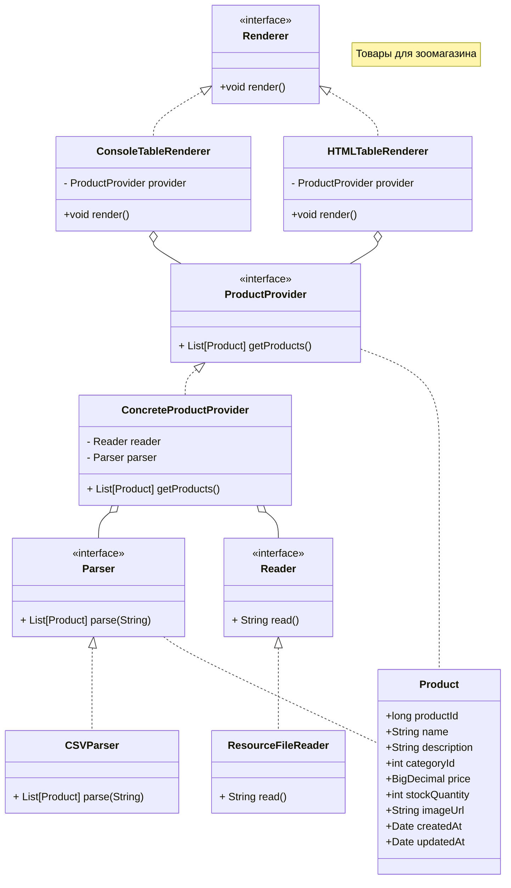
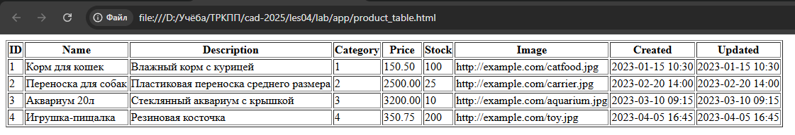

# Лабораторная работа №2. Конфигурирование приложения Spring с помощью аннотаций. Применение АОП для логирования

**Выполнил:** Хайруллин Эльдар Ринатович, группа 12002453

## Цель работы
Перевести конфигурирование Spring-приложения с Java-конфигурации на аннотации, освоить внедрение свойств через `@Value` и SpEL, познакомиться с жизненным циклом бинов, научиться применять АОП для измерения времени выполнения методов, а также реализовать альтернативный рендерер (HTML).

## Используемые инструменты
- JDK 17 (Temurin 17.0.14)
- Gradle 8.12
- Spring Context 6.2.2, Spring AOP 6.2.2
- AspectJ Weaver 1.9.22
- Jakarta Annotation API 2.1.1
- IntelliJ IDEA / командная строка

## Структура проекта
```
les04/lab
├── app
│   ├── build.gradle.kts
│   └── src
│       ├── main
│       │   ├── java/ru/bsuedu/cad/lab
│       │   │   ├── Main.java
│       │   │   ├── AppConfig.java
│       │   │   ├── Product.java
│       │   │   ├── Reader.java
│       │   │   ├── ResourceFileReader.java
│       │   │   ├── Parser.java
│       │   │   ├── CSVParser.java
│       │   │   ├── ProductProvider.java
│       │   │   ├── ConcreteProductProvider.java
│       │   │   ├── Renderer.java
│       │   │   ├── ConsoleTableRenderer.java
│       │   │   ├── HTMLTableRenderer.java
│       │   │   └── ParsingTimeAspect.java
│       │   └── resources
│       │       ├── products.csv
│       │       └── application.properties
│       └── test/...
└── settings.gradle.kts
```

## Диаграмма классов


## Выполнение работы

### 1. Копирование проекта и добавление зависимостей
- Результат лабораторной работы №1 скопирован в `les04/lab`.
- В `build.gradle.kts` добавлены зависимости `spring-aop`, `aspectjweaver`, `aspectjrt`, а также `jakarta.annotation-api` для поддержки `@PostConstruct` в Java 17.
- В блок `dependencies` добавлены строки:
  ```kotlin
  implementation("org.springframework:spring-aop:6.2.2")
  implementation("org.aspectj:aspectjweaver:1.9.22")
  runtimeOnly("org.aspectj:aspectjrt:1.9.22")
  implementation("jakarta.annotation:jakarta.annotation-api:2.1.1")
  ```

### 2. Переход на аннотации
- Все бины (`ResourceFileReader`, `CSVParser`, `ConcreteProductProvider`, `HTMLTableRenderer`, `ParsingTimeAspect`) помечены аннотацией `@Component`.
- Внедрение зависимостей выполнено через `@Autowired`.
- Конфигурационный класс `AppConfig` теперь содержит только `@ComponentScan`, `@PropertySource` и `@EnableAspectJAutoProxy`. Удалены старые методы `@Bean`, создававшие бины вручную.

### 3. Внедрение имени файла через @Value
- Создан файл `application.properties` с записью `products.file.name=products.csv`.
- В `ResourceFileReader` поле `fileName` аннотировано `@Value("${products.file.name}")`.

### 4. Жизненный цикл бина
- В `ResourceFileReader` добавлен метод `init()`, аннотированный `@PostConstruct`. При старте приложения выводится сообщение с текущей датой и временем:
  ```
  ResourceFileReader initialized at: Wed Jan 15 10:30:00 MSK 2025
  ```

### 5. Альтернативная реализация Renderer
- Создан класс `HTMLTableRenderer`, реализующий интерфейс `Renderer`. Он генерирует HTML-таблицу и сохраняет её в файл `product_table.html`.
- Аннотация `@Primary` на `HTMLTableRenderer` гарантирует, что при запросе бина типа `Renderer` будет возвращён именно он.
- Консольный рендерер `ConsoleTableRenderer` оставлен без аннотаций, чтобы не создавать конфликта.

### 6. АОП для измерения времени парсинга
- Создан аспект `ParsingTimeAspect` с советом `@Around`, измеряющим время выполнения метода `CSVParser.parse()`.
- В консоль выводится сообщение вида:
  ```
  CSV parsing took 12 ms
  ```

### 7. Проблемы с кэшем Gradle
- При первой сборке возник конфликт: несмотря на правильные настройки, контейнер продолжал использовать `ConsoleTableRenderer`.
- Проблема решена полной очисткой кэша и папки сборки командами:
  ```bash
  gradle clean
  rmdir /s /q app\build
  rmdir /s /q .gradle
  ```
- После перезапуска терминала и повторной сборки приложение заработало корректно: HTML-файл создаётся, время парсинга выводится.

## Результат работы
- При запуске `gradle run` в консоли отображается:
  * Дата и время инициализации `ResourceFileReader`.
  * Время парсинга CSV.
  * Сообщение о создании HTML-файла.
- В рабочей папке создаётся файл `product_table.html` с таблицей товаров.



## Инструкция по запуску
1. Перейти в папку `les04/lab`.
2. Выполнить `gradle run`.
3. Убедиться, что в консоли появились сообщения о времени инициализации и парсинга, а рядом с проектом создался файл `product_table.html`.

## Ответы на контрольные вопросы

**1. Виды конфигурирования ApplicationContext**
- XML-конфигурация.
- Java-конфигурация (с помощью классов с аннотацией `@Configuration`).
- Аннотационная конфигурация (с помощью стереотипных аннотаций и сканирования путей).

**2. Стереотипные аннотации**
`@Component` – общая аннотация для любого Spring-бина.
`@Service` – для сервисного слоя.
`@Repository` – для DAO-слоя.
`@Controller` – для веб-контроллеров.
Они позволяют автоматически обнаруживать бины при сканировании classpath.

**3. Инъекция зависимостей: виды автоматического связывания**
- `@Autowired` (по типу, с возможным уточнением через `@Qualifier`).
- `@Resource` (по имени, из стандарта JSR-250).
- `@Inject` (из JSR-330, требует дополнительных библиотек).

**4. Внедрение простых параметров**
Используется аннотация `@Value`, например:
```java
@Value("${products.file.name}")
private String fileName;
```

**5. Внедрение параметров с помощью SpEL**
В `@Value` можно использовать SpEL-выражения:
```java
@Value("#{systemProperties['user.region']}")
private String region;
```

**6. Режимы получения бинов**
- `Singleton` (по умолчанию) – один экземпляр на контейнер.
- `Prototype` – новый экземпляр при каждом запросе.
- Request/Session/Application/WebSocket – только в веб-приложениях.

**7. Жизненный цикл бинов**
1. Создание экземпляра.
2. Внедрение зависимостей.
3. Вызов методов, аннотированных `@PostConstruct`.
4. Бин готов к использованию.
5. При закрытии контейнера – вызов `@PreDestroy`.

**8. АОП: определение и основные понятия**
Аспектно-ориентированное программирование – парадигма, позволяющая вынести сквозную функциональность в отдельные модули (аспекты).
Основные понятия: аспект, совет (Advice), точка соединения (Join Point), срез (Pointcut), введение (Introduction).

**9. Типы АОП в Spring**
- Spring AOP (proxy-based, только для бинов).
- AspectJ (полнофункциональный, поддерживает внедрение в любой класс).

**10. Виды Advice**
- `@Before` – до выполнения метода.
- `@After` – после выполнения (в любом случае).
- `@AfterReturning` – после успешного возврата.
- `@AfterThrowing` – после выброса исключения.
- `@Around` – до и после, позволяет прервать выполнение.

**11. Виды Pointcut**
- `execution` – по сигнатуре метода.
- `within` – по классу/пакету.
- `@annotation` – по аннотации.
- `args` – по типам аргументов.

**12. Spring AOP и AspectJ: отличия**
Spring AOP реализован через прокси, работает только для бинов Spring и перехватывает только вызовы публичных методов. AspectJ использует инструментацию байт-кода, может перехватывать любые методы и конструкторы, не требуя Spring-контейнера, но сложнее в настройке.