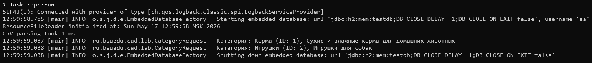

# Лабораторная работа №3. Технологии работы с базами данных. JDBC

**Выполнил:** Хайруллин Эльдар Ринатович, группа 12002453

## Цель работы
Научить приложение сохранять данные в базе данных, выполнять SQL-запросы и выводить их результаты в логи, используя JDBC, DataSource, JdbcTemplate и RowMapper.

## Используемые инструменты
- JDK 17 (Temurin 17.0.14)
- Gradle 8.12
- Spring Context 6.2.2, Spring AOP 6.2.2, Spring JDBC 6.2.2
- AspectJ Weaver 1.9.22
- Jakarta Annotation API 2.1.1
- H2 Database 2.3.232
- Logback 1.5.12

## Структура проекта
'''
les06/lab
├── app
│   ├── build.gradle.kts
│   └── src
│       ├── main
│       │   ├── java/ru/bsuedu/cad/lab
│       │   │   ├── Main.java
│       │   │   ├── AppConfig.java
│       │   │   ├── Product.java
│       │   │   ├── Category.java
│       │   │   ├── Reader.java
│       │   │   ├── ResourceFileReader.java
│       │   │   ├── Parser.java
│       │   │   ├── CSVParser.java
│       │   │   ├── ProductProvider.java
│       │   │   ├── ConcreteProductProvider.java
│       │   │   ├── CategoryProvider.java
│       │   │   ├── ConcreteCategoryProvider.java
│       │   │   ├── Renderer.java
│       │   │   ├── ConsoleTableRenderer.java
│       │   │   ├── HTMLTableRenderer.java
│       │   │   ├── DataBaseRenderer.java
│       │   │   ├── CategoryRequest.java
│       │   │   └── ParsingTimeAspect.java
│       │   └── resources
│       │       ├── products.csv
│       │       ├── category.csv
│       │       ├── application.properties
│       │       ├── schema.sql
│       │       └── logback.xml
│       └── test/...
└── settings.gradle.kts
'''

## Диаграмма классов
'''mermaid
classDiagram
    note "Товары для зоомагазина"
    Reader <|.. ResourceFileReader
    Parser <|.. CSVParser
    ProductProvider <|.. ConcreteProductProvider
    CategoryProvider <|.. ConcreteCategoryProvider
    Renderer <|.. ConsoleTableRenderer
    Renderer <|.. HTMLTableRenderer
    Renderer <|.. DataBaseRenderer
    DataBaseRenderer o-- ProductProvider
    DataBaseRenderer o-- CategoryProvider
    CategoryRequest .. JdbcTemplate
    ProductProvider .. Product
    CategoryProvider .. Category
    Parser .. Product
    Parser .. Category
    class Product {
        +long productId
        +String name
        +String description
        +int categoryId
        +BigDecimal price
        +int stockQuantity
        +String imageUrl
        +Date createdAt
        +Date updatedAt
    }
    class Category {
        +int categoryId
        +String name
        +String description
    }
'''

## Выполнение работы

### 1. Копирование проекта и добавление зависимостей
- Результат лабораторной работы №2 скопирован в `les06/lab`.
- В `build.gradle.kts` добавлены зависимости `spring-jdbc`, `h2`, `logback-classic`.

### 2. Создание SQL-скрипта и настройка базы данных
- Создан файл `schema.sql`, содержащий DDL-команды для создания таблиц CATEGORIES и PRODUCTS с внешним ключом.
- В `AppConfig.java` настроен `EmbeddedDatabaseBuilder`, который при старте приложения выполняет `schema.sql` и создаёт таблицы в H2.

### 3. Класс Category и ConcreteCategoryProvider
- Создан класс `Category` с полями `categoryId`, `name`, `description`.
- Создан интерфейс `CategoryProvider` и его реализация `ConcreteCategoryProvider`, читающая данные из `category.csv`.

### 4. DataBaseRenderer
- Реализован класс `DataBaseRenderer`, помеченный `@Primary`. Он получает списки товаров и категорий через провайдеры и вставляет их в соответствующие таблицы базы данных с помощью `JdbcTemplate`.

### 5. CategoryRequest и логирование
- Реализован класс `CategoryRequest`, который выполняет SQL-запрос, возвращающий категории с количеством товаров больше единицы.
- Результат запроса выводится в консоль через логгер Logback с уровнем INFO.

## Результат работы
При запуске `gradle run` приложение:
- Создаёт таблицы в базе данных H2.
- Загружает данные из CSV-файлов в таблицы.
- Выполняет запрос и выводит список категорий с количеством товаров более одного.

## Инструкция по запуску
1. Перейти в папку `les06/lab`.
2. Выполнить `gradle run`.

## Ответы на контрольные вопросы

**1. Что такое Spring JDBC и какие преимущества оно предоставляет по сравнению с традиционным JDBC?**
Spring JDBC — это модуль Spring Framework, упрощающий работу с базами данных через JDBC. Преимущества: управление ресурсами (автоматическое закрытие соединений), упрощённая обработка исключений, удобный JdbcTemplate, уменьшение шаблонного кода.

**2. Какой основной класс в Spring используется для работы с базой данных через JDBC?**
Основной класс — `JdbcTemplate`. Он предоставляет методы для выполнения SQL-запросов, обновлений, пакетной обработки и маппинга результатов.

**3. Какие шаги необходимо выполнить для настройки JDBC в Spring-приложении?**
Настроить `DataSource` (определить бин), создать бин `JdbcTemplate`, передав ему `DataSource`. Далее использовать `JdbcTemplate` в DAO-классах.

**4. Что такое JdbcTemplate и какие основные методы он предоставляет?**
`JdbcTemplate` — центральный класс Spring JDBC, инкапсулирующий логику работы с JDBC. Основные методы: `query()`, `queryForObject()`, `queryForList()`, `update()`, `batchUpdate()`, `execute()`.

**5. Как в Spring JDBC выполнить запрос на выборку данных (SELECT) и получить результат в виде объекта?**
Использовать метод `queryForObject()` с `RowMapper`, либо `query()` для получения списка объектов.

**6. Как использовать RowMapper в JdbcTemplate?**
`RowMapper` — функциональный интерфейс, преобразующий строку `ResultSet` в объект. Передаётся в методы `query()` или `queryForObject()`.

**7. Как выполнить вставку (INSERT) данных в базу с использованием JdbcTemplate?**
Использовать метод `update()` с SQL-запросом INSERT и параметрами.

**8. Как выполнить обновление (UPDATE) или удаление (DELETE) записей через JdbcTemplate?**
Аналогично вставке — через метод `update()` с соответствующим SQL-запросом.

**9. Как в Spring JDBC обрабатывать исключения, возникающие при работе с базой данных?**
Spring JDBC автоматически преобразует проверяемые SQLException в иерархию непроверяемых DataAccessException. Дополнительно можно использовать `@Repository` и `@Transactional` для управления транзакциями.

**10. Какие альтернативные способы работы с базой данных есть в Spring кроме JdbcTemplate?**
Spring Data JPA, Hibernate, MyBatis, Spring Data JDBC, R2DBC (для реактивного программирования).