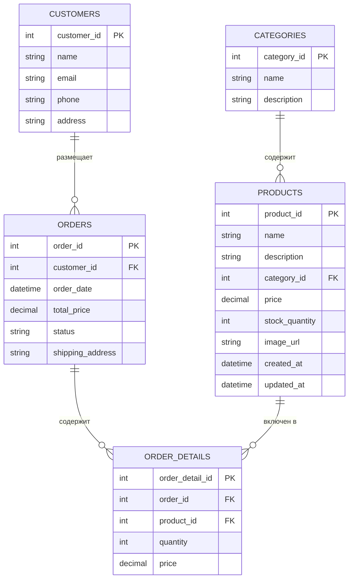

# Лабораторная работа №4. Технологии работы с базами данных. JPA. Spring Data

**Выполнил:** Хайруллин Эльдар Ринатович, группа 12002453

## Цель работы
Выполнить рефакторинг приложения зоомагазина: перейти с JDBC на ORM Hibernate и Spring Data JPA, внедрить слоистую архитектуру, добавить новые сущности и реализовать создание заказа в транзакции.

## Используемые инструменты
- JDK 17
- Gradle 8.12
- Spring Context 6.2.2, Spring Data JPA 3.4.4
- Hibernate 6.6.8
- HikariCP 6.2.1
- H2 Database 2.3.232
- Logback 1.5.12

## Структура проекта
```
les08/lab
├── app
│   ├── build.gradle.kts
│   └── src
│       ├── main
│       │   ├── java/ru/bsuedu/cad/lab
│       │   │   ├── AppConfig.java
│       │   │   ├── entity
│       │   │   │   ├── Category.java
│       │   │   │   ├── Product.java
│       │   │   │   ├── Customer.java
│       │   │   │   ├── Order.java
│       │   │   │   └── OrderDetail.java
│       │   │   ├── repository
│       │   │   │   ├── CategoryRepository.java
│       │   │   │   ├── ProductRepository.java
│       │   │   │   ├── CustomerRepository.java
│       │   │   │   ├── OrderRepository.java
│       │   │   │   └── OrderDetailRepository.java
│       │   │   ├── service
│       │   │   │   ├── DataLoaderService.java
│       │   │   │   └── OrderService.java
│       │   │   └── app
│       │   │       └── Main.java
│       │   └── resources
│       │       ├── application.properties
│       │       ├── logback.xml
│       │       ├── category.csv
│       │       ├── product.csv
│       │       └── customer.csv
│       └── test/...
└── settings.gradle.kts
```

## Диаграмма классов


## Выполнение работы

### 1. Рефакторинг проекта
- Проект переведён на слоистую архитектуру: entity, repository, service, app.
- Внедрены JPA-сущности с аннотациями @Entity, @Table, связями @OneToMany и @ManyToOne.
- Настроен HikariDataSource для подключения к H2.
- Hibernate настроен на автоматическое создание схемы (hbm2ddl.auto=update).

### 2. Загрузка данных
- Реализован DataLoaderService, читающий CSV-файлы (category.csv, product.csv, customer.csv) и сохраняющий данные через репозитории Spring Data.

### 3. Создание заказа
- OrderService.createOrder() создаёт заказ в транзакции, добавляет позиции заказа, вычисляет общую стоимость.
- Клиентское приложение вызывает сервис и выводит результат в лог.

### 4. Доказательство сохранения
- После создания заказа выполняется getAllOrders(), показывающий все заказы в базе данных.

## Результат работы
<details>
<summary>Консольный вывод</summary>

```text
13:23:58.314 [main] INFO  ru.bsuedu.cad.lab.app.Main - Data loaded from CSV files
13:23:58.339 [main] INFO  ru.bsuedu.cad.lab.app.Main - Order created: ID=1, Customer=Иван Петров, Total=2150.50, Status=NEW
13:23:58.402 [main] INFO  ru.bsuedu.cad.lab.app.Main - Total orders in database: 1
13:23:58.402 [main] INFO  ru.bsuedu.cad.lab.app.Main - Order ID=1, Customer=Иван Петров, Total=2150.50, Status=NEW
```

</details>

## Инструкция по запуску
1. Перейти в папку les08/lab.
2. Выполнить gradle run.
3. В консоли отобразятся SQL-запросы Hibernate, информация о создании заказа и список всех заказов.

## Ответы на контрольные вопросы

**Что такое JPA и для чего оно используется?**
JPA (Jakarta Persistence API) — спецификация для ORM в Java, определяющая правила отображения объектов на реляционные базы данных.

**Чем JPA отличается от Hibernate?**
JPA — спецификация (интерфейс), Hibernate — одна из реализаций этой спецификации.

**Что делает аннотация @Entity?**
Указывает, что класс является JPA-сущностью, отображаемой на таблицу базы данных.

**Для чего нужна аннотация @Table?**
Позволяет явно задать имя таблицы и другие параметры отображения сущности.

**Как обозначить первичный ключ в JPA?**
Аннотацией @Id над полем-ключом.

**Что делает аннотация @GeneratedValue?**
Включает автоматическую генерацию значений первичного ключа.

**Какие бывают стратегии генерации идентификаторов в JPA?**
AUTO, IDENTITY, SEQUENCE, TABLE.

**Чем отличается @Column(name = "field_name") от использования имени поля напрямую?**
Позволяет задать имя столбца в БД, отличное от имени поля в Java-классе.

**Как задать связь “один ко многим” (@OneToMany) в JPA?**
Аннотацией @OneToMany на поле-коллекции, обычно с mappedBy для двунаправленных связей.

**Как задать связь “многие ко многим” (@ManyToMany) в JPA?**
Аннотацией @ManyToMany на обоих сторонах связи, с @JoinTable на владельце.

**Что такое Spring Data и зачем оно нужно?**
Spring Data — проект Spring, упрощающий работу с различными хранилищами данных, предоставляющий автоматическую реализацию репозиториев.

**Что делает интерфейс CrudRepository?**
Предоставляет базовые CRUD-операции: save, findById, findAll, delete.

**Чем JpaRepository отличается от CrudRepository?**
JpaRepository расширяет CrudRepository, добавляя методы для пагинации, сортировки и пакетных операций.

**Как создать свой репозиторий в Spring Data JPA?**
Создать интерфейс, расширяющий CrudRepository или JpaRepository, с указанием типа сущности и типа ключа.

**Как выполнить поиск по ID с помощью Spring Data JPA?**
Метод findById(id), возвращающий Optional.

**Как добавить новую запись в базу данных через Spring Data JPA?**
Метод save(entity) репозитория.

**Как удалить объект из базы данных в Spring Data JPA?**
Метод delete(entity) или deleteById(id).

**Как написать свой SQL-запрос в Spring Data JPA?**
Аннотацией @Query над методом репозитория.

**Что такое @Transactional и зачем она нужна?**
Аннотация, определяющая границы транзакции. Обеспечивает атомарность операций.

**Какие аннотации нужны для работы с JPA-сущностями?**
@Entity, @Table, @Id, @GeneratedValue, @Column, @OneToMany, @ManyToOne, @ManyToMany, @JoinColumn, @JoinTable.