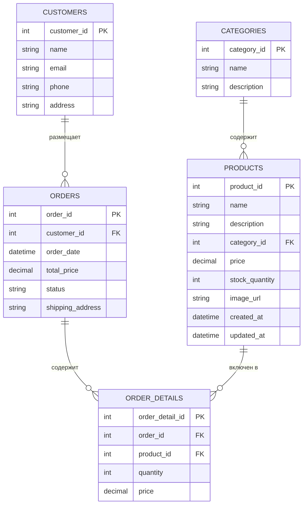

# Лабораторная работа №4. Технологии работы с базами данных. JPA. Spring Data

**Выполнил:** Хайруллин Эльдар Ринатович, группа 12002453

## Цель работы
Выполнить рефакторинг приложения зоомагазина: перейти с JDBC на ORM Hibernate и Spring Data JPA, внедрить слоистую архитектуру, добавить новые сущности и реализовать создание заказа в транзакции.

## Используемые инструменты
- JDK 17
- Gradle 8.12
- Spring Context 6.2.2, Spring Data JPA 3.4.4
- Hibernate 6.6.8
- HikariCP 6.2.1
- H2 Database 2.3.232
- Logback 1.5.12

## Структура проекта
```
les08/lab
├── app
│   ├── build.gradle.kts
│   └── src
│       ├── main
│       │   ├── java/ru/bsuedu/cad/lab
│       │   │   ├── AppConfig.java
│       │   │   ├── entity
│       │   │   │   ├── Category.java
│       │   │   │   ├── Product.java
│       │   │   │   ├── Customer.java
│       │   │   │   ├── Order.java
│       │   │   │   └── OrderDetail.java
│       │   │   ├── repository
│       │   │   │   ├── CategoryRepository.java
│       │   │   │   ├── ProductRepository.java
│       │   │   │   ├── CustomerRepository.java
│       │   │   │   ├── OrderRepository.java
│       │   │   │   └── OrderDetailRepository.java
│       │   │   ├── service
│       │   │   │   ├── DataLoaderService.java
│       │   │   │   └── OrderService.java
│       │   │   └── app
│       │   │       └── Main.java
│       │   └── resources
│       │       ├── application.properties
│       │       ├── logback.xml
│       │       ├── category.csv
│       │       ├── product.csv
│       │       └── customer.csv
│       └── test/...
└── settings.gradle.kts
```

## Диаграмма классов


## Выполнение работы

### 1. Рефакторинг проекта
- Проект переведён на слоистую архитектуру: entity, repository, service, app.
- Внедрены JPA-сущности с аннотациями @Entity, @Table, связями @OneToMany и @ManyToOne.
- Настроен HikariDataSource для подключения к H2.
- Hibernate настроен на автоматическое создание схемы (hbm2ddl.auto=update).

### 2. Загрузка данных
- Реализован DataLoaderService, читающий CSV-файлы (category.csv, product.csv, customer.csv) и сохраняющий данные через репозитории Spring Data.

### 3. Создание заказа
- OrderService.createOrder() создаёт заказ в транзакции, добавляет позиции заказа, вычисляет общую стоимость.
- Клиентское приложение вызывает сервис и выводит результат в лог.

### 4. Доказательство сохранения
- После создания заказа выполняется getAllOrders(), показывающий все заказы в базе данных.

## Результат работы
<details>
<summary>Консольный вывод</summary>
```
> Task :app:run
SLF4J(I): Connected with provider of type [ch.qos.logback.classic.spi.LogbackServiceProvider]
13:23:55.991 [main] INFO  o.s.d.r.c.RepositoryConfigurationDelegate - Bootstrapping Spring Data JPA repositories in DEFAULT mode.
13:23:56.047 [main] INFO  o.s.d.r.c.RepositoryConfigurationDelegate - Finished Spring Data repository scanning in 46 ms. Found 5 JPA repository interfaces.
13:23:56.292 [main] INFO  o.h.jpa.internal.util.LogHelper - HHH000204: Processing PersistenceUnitInfo [name: default]
13:23:56.331 [main] INFO  org.hibernate.Version - HHH000412: Hibernate ORM core version 6.6.8.Final
13:23:56.354 [main] INFO  o.h.c.i.RegionFactoryInitiator - HHH000026: Second-level cache disabled
13:23:56.645 [main] INFO  o.s.o.j.p.SpringPersistenceUnitInfo - No LoadTimeWeaver setup: ignoring JPA class transformer
13:23:56.673 [main] INFO  com.zaxxer.hikari.HikariDataSource - HikariPool-1 - Starting...
13:23:56.795 [main] INFO  com.zaxxer.hikari.pool.HikariPool - HikariPool-1 - Added connection conn0: url=jdbc:h2:mem:testdb user=SA
13:23:56.796 [main] INFO  com.zaxxer.hikari.HikariDataSource - HikariPool-1 - Start completed.
13:23:56.812 [main] WARN  org.hibernate.orm.deprecation - HHH90000025: H2Dialect does not need to be specified explicitly using 'hibernate.dialect' (remove the property setting and it will be selected by default)
13:23:56.831 [main] INFO  o.hibernate.orm.connections.pooling - HHH10001005: Database info:
        Database JDBC URL [Connecting through datasource 'HikariDataSource (HikariPool-1)']
        Database driver: undefined/unknown
        Database version: 2.3.232
        Autocommit mode: undefined/unknown
        Isolation level: undefined/unknown
        Minimum pool size: undefined/unknown
        Maximum pool size: undefined/unknown
13:23:57.650 [main] INFO  o.h.e.t.j.p.i.JtaPlatformInitiator - HHH000489: No JTA platform available (set 'hibernate.transaction.jta.platform' to enable JTA platform integration)
Hibernate:
    create table CATEGORIES (
        category_id integer not null,
        description varchar(255),
        name varchar(255),
        primary key (category_id)
    )
Hibernate:
    create table CUSTOMERS (
        customer_id integer not null,
        address varchar(255),
        email varchar(255),
        name varchar(255),
        phone varchar(255),
        primary key (customer_id)
    )
Hibernate:
    create table ORDER_DETAILS (
        order_detail_id integer generated by default as identity,
        price numeric(38,2),
        quantity integer,
        order_id integer,
        product_id integer,
        primary key (order_detail_id)
    )
Hibernate:
    create table ORDERS (
        order_id integer generated by default as identity,
        order_date timestamp(6),
        shipping_address varchar(255),
        status varchar(255),
        total_price numeric(38,2),
        customer_id integer,
        primary key (order_id)
    )
Hibernate:
    create table PRODUCTS (
        product_id integer not null,
        created_at timestamp(6),
        description varchar(255),
        image_url varchar(255),
        name varchar(255),
        price numeric(38,2),
        stock_quantity integer,
        updated_at timestamp(6),
        category_id integer,
        primary key (product_id)
    )
Hibernate:
    alter table if exists ORDER_DETAILS
       add constraint FK8wdku4h4c96gwubj09an8bby6
       foreign key (order_id)
       references ORDERS
Hibernate:
    alter table if exists ORDER_DETAILS
       add constraint FKpshg2yc6vr6npa8jkbryetxrx
       foreign key (product_id)
       references PRODUCTS
Hibernate:
    alter table if exists ORDERS
       add constraint FK1nbewmmir6psft27yfvvmwpfg
       foreign key (customer_id)
       references CUSTOMERS
Hibernate:
    alter table if exists PRODUCTS
       add constraint FK860uwmfahxkeahlm8a800vmnb
       foreign key (category_id)
       references CATEGORIES
13:23:57.701 [main] INFO  o.s.o.j.LocalContainerEntityManagerFactoryBean - Initialized JPA EntityManagerFactory for persistence unit 'default'
Hibernate:
    select
        c1_0.category_id,
        c1_0.description,
        c1_0.name
    from
        CATEGORIES c1_0
    where
        c1_0.category_id=?
Hibernate:
    select
        c1_0.category_id,
        c1_0.description,
        c1_0.name
    from
        CATEGORIES c1_0
    where
        c1_0.category_id=?
Hibernate:
    select
        c1_0.category_id,
        c1_0.description,
        c1_0.name
    from
        CATEGORIES c1_0
    where
        c1_0.category_id=?
Hibernate:
    select
        c1_0.category_id,
        c1_0.description,
        c1_0.name
    from
        CATEGORIES c1_0
    where
        c1_0.category_id=?
Hibernate:
    select
        c1_0.category_id,
        c1_0.description,
        c1_0.name
    from
        CATEGORIES c1_0
    where
        c1_0.category_id=?
Hibernate:
    select
        p1_0.product_id,
        c1_0.category_id,
        c1_0.description,
        c1_0.name,
        p1_0.created_at,
        p1_0.description,
        p1_0.image_url,
        p1_0.name,
        p1_0.price,
        p1_0.stock_quantity,
        p1_0.updated_at
    from
        PRODUCTS p1_0
    left join
        CATEGORIES c1_0
            on c1_0.category_id=p1_0.category_id
    where
        p1_0.product_id=?
Hibernate:
    select
        p1_0.product_id,
        c1_0.category_id,
        c1_0.description,
        c1_0.name,
        p1_0.created_at,
        p1_0.description,
        p1_0.image_url,
        p1_0.name,
        p1_0.price,
        p1_0.stock_quantity,
        p1_0.updated_at
    from
        PRODUCTS p1_0
    left join
        CATEGORIES c1_0
            on c1_0.category_id=p1_0.category_id
    where
        p1_0.product_id=?
Hibernate:
    select
        p1_0.product_id,
        c1_0.category_id,
        c1_0.description,
        c1_0.name,
        p1_0.created_at,
        p1_0.description,
        p1_0.image_url,
        p1_0.name,
        p1_0.price,
        p1_0.stock_quantity,
        p1_0.updated_at
    from
        PRODUCTS p1_0
    left join
        CATEGORIES c1_0
            on c1_0.category_id=p1_0.category_id
    where
        p1_0.product_id=?
Hibernate:
    select
        p1_0.product_id,
        c1_0.category_id,
        c1_0.description,
        c1_0.name,
        p1_0.created_at,
        p1_0.description,
        p1_0.image_url,
        p1_0.name,
        p1_0.price,
        p1_0.stock_quantity,
        p1_0.updated_at
    from
        PRODUCTS p1_0
    left join
        CATEGORIES c1_0
            on c1_0.category_id=p1_0.category_id
    where
        p1_0.product_id=?
Hibernate:
    select
        p1_0.product_id,
        c1_0.category_id,
        c1_0.description,
        c1_0.name,
        p1_0.created_at,
        p1_0.description,
        p1_0.image_url,
        p1_0.name,
        p1_0.price,
        p1_0.stock_quantity,
        p1_0.updated_at
    from
        PRODUCTS p1_0
    left join
        CATEGORIES c1_0
            on c1_0.category_id=p1_0.category_id
    where
        p1_0.product_id=?
Hibernate:
    select
        c1_0.customer_id,
        c1_0.address,
        c1_0.email,
        c1_0.name,
        c1_0.phone
    from
        CUSTOMERS c1_0
    where
        c1_0.customer_id=?
Hibernate:
    select
        c1_0.customer_id,
        c1_0.address,
        c1_0.email,
        c1_0.name,
        c1_0.phone
    from
        CUSTOMERS c1_0
    where
        c1_0.customer_id=?
Hibernate:
    select
        c1_0.customer_id,
        c1_0.address,
        c1_0.email,
        c1_0.name,
        c1_0.phone
    from
        CUSTOMERS c1_0
    where
        c1_0.customer_id=?
Hibernate:
    insert
    into
        CATEGORIES
        (description, name, category_id)
    values
        (?, ?, ?)
Hibernate:
    insert
    into
        CATEGORIES
        (description, name, category_id)
    values
        (?, ?, ?)
Hibernate:
    insert
    into
        CATEGORIES
        (description, name, category_id)
    values
        (?, ?, ?)
Hibernate:
    insert
    into
        CATEGORIES
        (description, name, category_id)
    values
        (?, ?, ?)
Hibernate:
    insert
    into
        CATEGORIES
        (description, name, category_id)
    values
        (?, ?, ?)
Hibernate:
    insert
    into
        PRODUCTS
        (category_id, created_at, description, image_url, name, price, stock_quantity, updated_at, product_id)
    values
        (?, ?, ?, ?, ?, ?, ?, ?, ?)
Hibernate:
    insert
    into
        PRODUCTS
        (category_id, created_at, description, image_url, name, price, stock_quantity, updated_at, product_id)
    values
        (?, ?, ?, ?, ?, ?, ?, ?, ?)
Hibernate:
    insert
    into
        PRODUCTS
        (category_id, created_at, description, image_url, name, price, stock_quantity, updated_at, product_id)
    values
        (?, ?, ?, ?, ?, ?, ?, ?, ?)
Hibernate:
    insert
    into
        PRODUCTS
        (category_id, created_at, description, image_url, name, price, stock_quantity, updated_at, product_id)
    values
        (?, ?, ?, ?, ?, ?, ?, ?, ?)
Hibernate:
    insert
    into
        PRODUCTS
        (category_id, created_at, description, image_url, name, price, stock_quantity, updated_at, product_id)
    values
        (?, ?, ?, ?, ?, ?, ?, ?, ?)
Hibernate:
    insert
    into
        CUSTOMERS
        (address, email, name, phone, customer_id)
    values
        (?, ?, ?, ?, ?)
Hibernate:
    insert
    into
        CUSTOMERS
        (address, email, name, phone, customer_id)
    values
        (?, ?, ?, ?, ?)
Hibernate:
    insert
    into
        CUSTOMERS
        (address, email, name, phone, customer_id)
    values
        (?, ?, ?, ?, ?)
13:23:58.314 [main] INFO  ru.bsuedu.cad.lab.app.Main - Data loaded from CSV files
Hibernate:
    select
        c1_0.customer_id,
        c1_0.address,
        c1_0.email,
        c1_0.name,
        c1_0.phone
    from
        CUSTOMERS c1_0
    where
        c1_0.customer_id=?
Hibernate:
    select
        p1_0.product_id,
        c1_0.category_id,
        c1_0.description,
        c1_0.name,
        p1_0.created_at,
        p1_0.description,
        p1_0.image_url,
        p1_0.name,
        p1_0.price,
        p1_0.stock_quantity,
        p1_0.updated_at
    from
        PRODUCTS p1_0
    left join
        CATEGORIES c1_0
            on c1_0.category_id=p1_0.category_id
    where
        p1_0.product_id=?
Hibernate:
    select
        p1_0.product_id,
        c1_0.category_id,
        c1_0.description,
        c1_0.name,
        p1_0.created_at,
        p1_0.description,
        p1_0.image_url,
        p1_0.name,
        p1_0.price,
        p1_0.stock_quantity,
        p1_0.updated_at
    from
        PRODUCTS p1_0
    left join
        CATEGORIES c1_0
            on c1_0.category_id=p1_0.category_id
    where
        p1_0.product_id=?
Hibernate:
    insert
    into
        ORDERS
        (customer_id, order_date, shipping_address, status, total_price, order_id)
    values
        (?, ?, ?, ?, ?, default)
Hibernate:
    insert
    into
        ORDER_DETAILS
        (order_id, price, product_id, quantity, order_detail_id)
    values
        (?, ?, ?, ?, default)
Hibernate:
    insert
    into
        ORDER_DETAILS
        (order_id, price, product_id, quantity, order_detail_id)
    values
        (?, ?, ?, ?, default)
13:23:58.339 [main] INFO  ru.bsuedu.cad.lab.app.Main - Order created: ID=1, Customer=Иван Петров, Total=2150.50, Status=NEW
Hibernate:
    select
        o1_0.order_id,
        o1_0.customer_id,
        o1_0.order_date,
        o1_0.shipping_address,
        o1_0.status,
        o1_0.total_price
    from
        ORDERS o1_0
Hibernate:
    select
        c1_0.customer_id,
        c1_0.address,
        c1_0.email,
        c1_0.name,
        c1_0.phone
    from
        CUSTOMERS c1_0
    where
        c1_0.customer_id=?
13:23:58.402 [main] INFO  ru.bsuedu.cad.lab.app.Main - Total orders in database: 1
13:23:58.402 [main] INFO  ru.bsuedu.cad.lab.app.Main - Order ID=1, Customer=Иван Петров, Total=2150.50, Status=NEW
13:23:58.402 [main] INFO  o.s.o.j.LocalContainerEntityManagerFactoryBean - Closing JPA EntityManagerFactory for persistence unit 'default'
13:23:58.404 [main] INFO  com.zaxxer.hikari.HikariDataSource - HikariPool-1 - Shutdown initiated...
13:23:58.405 [main] INFO  com.zaxxer.hikari.HikariDataSource - HikariPool-1 - Shutdown completed.
```
</details>

## Инструкция по запуску
1. Перейти в папку les08/lab.
2. Выполнить gradle run.
3. В консоли отобразятся SQL-запросы Hibernate, информация о создании заказа и список всех заказов.

## Ответы на контрольные вопросы

**Что такое JPA и для чего оно используется?**
JPA (Jakarta Persistence API) — спецификация для ORM в Java, определяющая правила отображения объектов на реляционные базы данных.

**Чем JPA отличается от Hibernate?**
JPA — спецификация (интерфейс), Hibernate — одна из реализаций этой спецификации.

**Что делает аннотация @Entity?**
Указывает, что класс является JPA-сущностью, отображаемой на таблицу базы данных.

**Для чего нужна аннотация @Table?**
Позволяет явно задать имя таблицы и другие параметры отображения сущности.

**Как обозначить первичный ключ в JPA?**
Аннотацией @Id над полем-ключом.

**Что делает аннотация @GeneratedValue?**
Включает автоматическую генерацию значений первичного ключа.

**Какие бывают стратегии генерации идентификаторов в JPA?**
AUTO, IDENTITY, SEQUENCE, TABLE.

**Чем отличается @Column(name = "field_name") от использования имени поля напрямую?**
Позволяет задать имя столбца в БД, отличное от имени поля в Java-классе.

**Как задать связь “один ко многим” (@OneToMany) в JPA?**
Аннотацией @OneToMany на поле-коллекции, обычно с mappedBy для двунаправленных связей.

**Как задать связь “многие ко многим” (@ManyToMany) в JPA?**
Аннотацией @ManyToMany на обоих сторонах связи, с @JoinTable на владельце.

**Что такое Spring Data и зачем оно нужно?**
Spring Data — проект Spring, упрощающий работу с различными хранилищами данных, предоставляющий автоматическую реализацию репозиториев.

**Что делает интерфейс CrudRepository?**
Предоставляет базовые CRUD-операции: save, findById, findAll, delete.

**Чем JpaRepository отличается от CrudRepository?**
JpaRepository расширяет CrudRepository, добавляя методы для пагинации, сортировки и пакетных операций.

**Как создать свой репозиторий в Spring Data JPA?**
Создать интерфейс, расширяющий CrudRepository или JpaRepository, с указанием типа сущности и типа ключа.

**Как выполнить поиск по ID с помощью Spring Data JPA?**
Метод findById(id), возвращающий Optional.

**Как добавить новую запись в базу данных через Spring Data JPA?**
Метод save(entity) репозитория.

**Как удалить объект из базы данных в Spring Data JPA?**
Метод delete(entity) или deleteById(id).

**Как написать свой SQL-запрос в Spring Data JPA?**
Аннотацией @Query над методом репозитория.

**Что такое @Transactional и зачем она нужна?**
Аннотация, определяющая границы транзакции. Обеспечивает атомарность операций.

**Какие аннотации нужны для работы с JPA-сущностями?**
@Entity, @Table, @Id, @GeneratedValue, @Column, @OneToMany, @ManyToOne, @ManyToMany, @JoinColumn, @JoinTable.