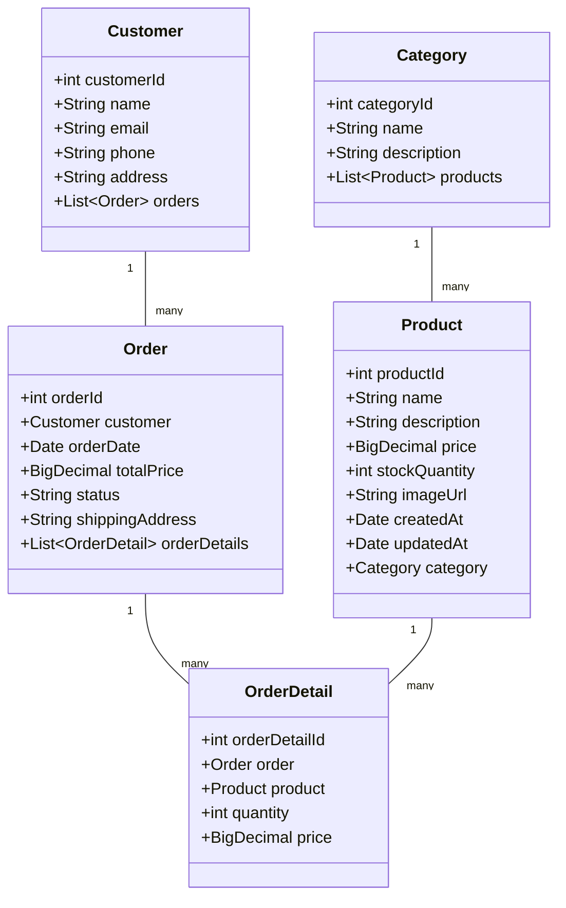
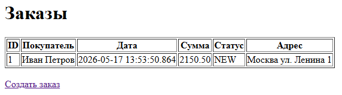
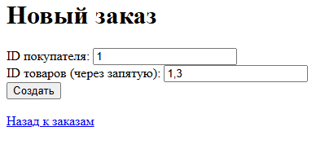
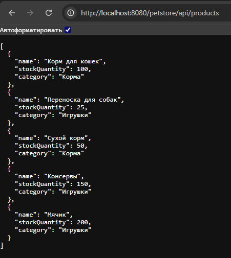

# Лабораторная работа №5. Разработка и развертывание Web-приложений

**Выполнил:** Хайруллин Эльдар Ринатович, группа 12002453

## Цель работы
Разработать Web-интерфейс для магазина зоотоваров: сервлеты для просмотра и создания заказов, REST-сервис для получения информации о продуктах, сборку WAR-файла и деплой на Tomcat 11.

## Используемые инструменты
- JDK 17
- Gradle 8.12
- Spring Context 6.2.2, Spring Web MVC 6.2.2, Spring Data JPA 3.4.4
- Hibernate 6.6.8, HikariCP 6.2.1, H2 Database 2.3.232
- Jackson 2.18.2, Jakarta Servlet API 6.1.0
- Apache Tomcat 11, Postman

## Структура проекта
```
les10/lab
├── app
│   ├── build.gradle.kts
│   └── src
│       ├── main
│       │   ├── java/ru/bsuedu/cad/lab
│       │   │   ├── AppConfig.java
│       │   │   ├── WebConfig.java
│       │   │   ├── DataInitializer.java
│       │   │   ├── entity
│       │   │   │   ├── Category.java
│       │   │   │   ├── Product.java
│       │   │   │   ├── Customer.java
│       │   │   │   ├── Order.java
│       │   │   │   └── OrderDetail.java
│       │   │   ├── repository
│       │   │   │   ├── CategoryRepository.java
│       │   │   │   ├── ProductRepository.java
│       │   │   │   ├── CustomerRepository.java
│       │   │   │   ├── OrderRepository.java
│       │   │   │   └── OrderDetailRepository.java
│       │   │   ├── service
│       │   │   │   ├── DataLoaderService.java
│       │   │   │   └── OrderService.java
│       │   │   └── web
│       │   │       ├── OrderListController.java
│       │   │       ├── CreateOrderController.java
│       │   │       └── ProductRestController.java
│       │   ├── resources
│       │   │   ├── application.properties
│       │   │   ├── logback.xml
│       │   │   ├── category.csv
│       │   │   ├── product.csv
│       │   │   └── customer.csv
│       │   └── webapp
│       │       └── WEB-INF
│       │           └── web.xml
│       └── test/...
└── settings.gradle.kts
```

## UML-диаграмма классов


## Результат работы
<details>
<summary>Скриншоты приложения</summary>

### Список заказов


### Форма создания заказа


### REST API (Postman Agent у меня не запустился)


</details>

## Инструкция по запуску
1. Собрать WAR-файл командой gradle war.
2. Развернуть petstore.war в Tomcat 11.
3. Открыть http://localhost:8080/petstore/orders.

## Ответы на контрольные вопросы

**Что такое Servlet и зачем он нужен?**
Servlet — это Java-класс, работающий на стороне сервера и обрабатывающий HTTP-запросы/ответы. Он является основой Java-веб-приложений.

**Что делает web.xml и зачем он нужен в веб-приложении?**
Дескриптор развертывания, который конфигурирует сервлеты, фильтры, слушателей и другие компоненты веб-приложения.

**Что такое WAR-файл и чем он отличается от JAR?**
WAR (Web Application Archive) — это JAR-архив для веб-приложений, содержащий сервлеты, JSP, HTML и другие ресурсы. JAR содержит только Java-классы.

**Что такое ServletContext и как его использовать?**
ServletContext — это интерфейс для взаимодействия сервлета с контейнером сервлетов. Используется для получения параметров инициализации, доступа к ресурсам и атрибутам приложения.

**Чем отличается HttpServletRequest от HttpServletResponse?**
HttpServletRequest предоставляет информацию о запросе клиента, а HttpServletResponse используется для формирования ответа клиенту.

**Какой интерфейс нужно реализовать, чтобы создать Listener, реагирующий на запуск приложения?**
ServletContextListener с методами contextInitialized() и contextDestroyed().

**Как получить доступ к Spring ApplicationContext внутри обычного сервлета?**
Через WebApplicationContextUtils.getWebApplicationContext(getServletContext()).

**Что делает ContextLoaderListener в Spring-приложении?**
Загружает корневой Spring ApplicationContext при старте веб-приложения.

**Зачем нужно использовать @WebServlet и чем он лучше/хуже конфигурации в web.xml?**
@WebServlet позволяет конфигурировать сервлет аннотациями, что делает код более читаемым и не требует редактирования web.xml. Недостаток — конфигурация жестко зафиксирована в коде.

**Как можно использовать один Spring Bean в нескольких сервлетах?**
Через внедрение зависимостей с помощью WebApplicationContextUtils.