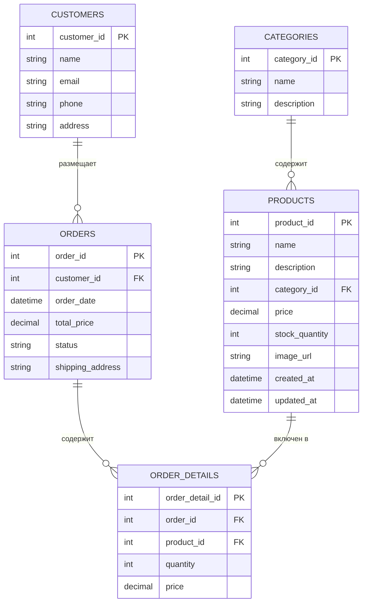
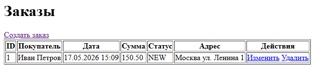
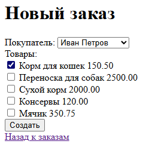

# Лабораторная работа №6. Разработка Web-приложений с использованием технологии Spring MVC

**Выполнил:** Хайруллин Эльдар Ринатович, группа 12002453

## Цель работы
Перейти от сервлетов к Spring MVC, реализовать REST API для CRUD-операций с заказами, подключить Thymeleaf для веб-интерфейса и выполнить деплой на Tomcat 11.

## Используемые инструменты
- JDK 17
- Gradle 8.12
- Spring Context 6.2.2, Spring Web MVC 6.2.2, Spring Data JPA 3.4.4
- Hibernate 6.6.8, HikariCP 6.2.1, H2 Database 2.3.232
- Thymeleaf 3.1.3, Jackson 2.18.2
- Apache Tomcat 11

## Структура проекта
```
les12/lab
├── app
│   ├── build.gradle.kts
│   └── src
│       ├── main
│       │   ├── java/ru/bsuedu/cad/lab
│       │   │   ├── AppConfig.java
│       │   │   ├── WebConfig.java
│       │   │   ├── DataInitializer.java
│       │   │   ├── entity
│       │   │   │   ├── Category.java
│       │   │   │   ├── Product.java
│       │   │   │   ├── Customer.java
│       │   │   │   ├── Order.java
│       │   │   │   └── OrderDetail.java
│       │   │   ├── repository
│       │   │   │   ├── CategoryRepository.java
│       │   │   │   ├── ProductRepository.java
│       │   │   │   ├── CustomerRepository.java
│       │   │   │   ├── OrderRepository.java
│       │   │   │   └── OrderDetailRepository.java
│       │   │   ├── service
│       │   │   │   ├── DataLoaderService.java
│       │   │   │   └── OrderService.java
│       │   │   └── web
│       │   │       ├── OrderRestController.java
│       │   │       └── OrderWebController.java
│       │   ├── resources
│       │   │   ├── application.properties
│       │   │   ├── logback.xml
│       │   │   ├── category.csv
│       │   │   ├── product.csv
│       │   │   └── customer.csv
│       │   └── webapp
│       │       └── WEB-INF
│       │           ├── web.xml
│       │           └── views
│       │               └── order
│       │                   ├── list.html
│       │                   ├── create.html
│       │                   └── edit.html
│       └── test/...
└── settings.gradle.kts
```

## Диаграмма классов


## Выполнение работы

### 1. Переход на Spring MVC
- Удалены сервлеты предыдущей лабораторной работы (аннотации `@WebServlet`).
- Добавлен `DispatcherServlet` и корневой слушатель `ContextLoaderListener` в `web.xml`.
- Создан конфигурационный класс `WebConfig` с `@EnableWebMvc`, сканированием пакета `web` и настройкой Thymeleaf.

### 2. REST API
- Контроллер `OrderRestController` обрабатывает запросы `/api/orders`:
  * `GET /` – список всех заказов в JSON.
  * `GET /{id}` – заказ по ID.
  * `POST /` – создание заказа (тело: `{ "customerId": 1, "productIds": [1,3] }`).
  * `PUT /{id}` – обновление заказа.
  * `DELETE /{id}` – удаление заказа.

### 3. Веб-интерфейс на Thymeleaf
- `OrderWebController` с маппингом `/orders` обслуживает HTML-страницы:
  * `GET /orders` – список заказов (шаблон `order/list.html`).
  * `GET /orders/create` – форма создания заказа (`order/create.html`).
  * `POST /orders/create` – обработка создания заказа.
  * `GET /orders/edit/{id}` – форма редактирования (`order/edit.html`).
  * `POST /orders/edit/{id}` – сохранение изменений.
  * `GET /orders/delete/{id}` – удаление заказа.

### 4. Загрузка данных через `@PostConstruct`
- `DataLoaderService` загружает данные из CSV при старте контекста благодаря методу с аннотацией `@PostConstruct`, что исключило необходимость в сервлет-листенере.

### 5. Устранение ошибок деплоя
- Первоначально `web.xml` ошибочно располагался в корне `webapp` вместо `WEB-INF`, из-за чего Tomcat не загружал Spring-контекст. После перемещения файла в `WEB-INF` приложение успешно стартовало.

## Результат работы

<details>
<summary>Список заказов (веб-интерфейс)</summary>



</details>

<details>
<summary>Создание заказа (веб-интерфейс)</summary>



</details>

<details>
<summary>REST API (JSON-ответ)</summary>

```json
[
  {
    "orderId": 1,
    "orderDate": "2026-05-17T14:53:46.000+00:00",
    "totalPrice": 2150.50,
    "status": "NEW",
    "shippingAddress": "Москва ул. Ленина 1",
    "customer": {
      "customerId": 1,
      "name": "Иван Петров"
    },
    "orderDetails": [
      {
        "orderDetailId": 1,
        "product": {
          "productId": 1,
          "name": "Корм для кошек"
        },
        "quantity": 1,
        "price": 150.50
      }
    ]
  }
]
```

</details>

## Инструкция по запуску
1. Собрать WAR-файл: `gradle clean build war`.
2. Развернуть `petstore.war` в Tomcat 11, открыть `http://localhost:8080/petstore/orders`.
3. Протестировать REST API через браузер или curl.

## Ответы на контрольные вопросы

**Что означает аббревиатура MVC и каковы её основные компоненты?**
MVC (Model-View-Controller) — архитектурный паттерн, разделяющий данные, отображение и логику обработки запросов.

**Какую роль выполняет DispatcherServlet в Spring MVC?**
Центральный диспетчер, принимающий все HTTP-запросы и направляющий их нужным контроллерам.

**Какая аннотация используется для указания, что класс является контроллером?**
`@Controller` (или `@RestController` для REST API).

**Чем отличаются аннотации @Controller и @RestController?**
`@RestController` автоматически добавляет `@ResponseBody` ко всем методам, возвращая данные напрямую, а не имя представления.

**Какой аннотацией можно связать параметр метода с переменной из URL?**
`@PathVariable`.

**Что такое Model в Spring MVC и как она используется?**
`Model` — интерфейс для передачи данных от контроллера к представлению через метод `addAttribute`.

**Что делает аннотация @RequestMapping?**
Связывает URL-шаблоны и HTTP-методы с методами контроллера.

**Какие HTTP-методы можно обрабатывать в Spring MVC и какими аннотациями?**
GET (`@GetMapping`), POST (`@PostMapping`), PUT (`@PutMapping`), DELETE (`@DeleteMapping`), PATCH (`@PatchMapping`).

**Что такое ViewResolver и зачем он нужен в Spring MVC?**
`ViewResolver` преобразует логическое имя представления в конкретный объект View (например, ThymeleafViewResolver).

**Как вернуть JSON из контроллера без использования шаблонов?**
Пометить класс аннотацией `@RestController` или метод аннотацией `@ResponseBody`.