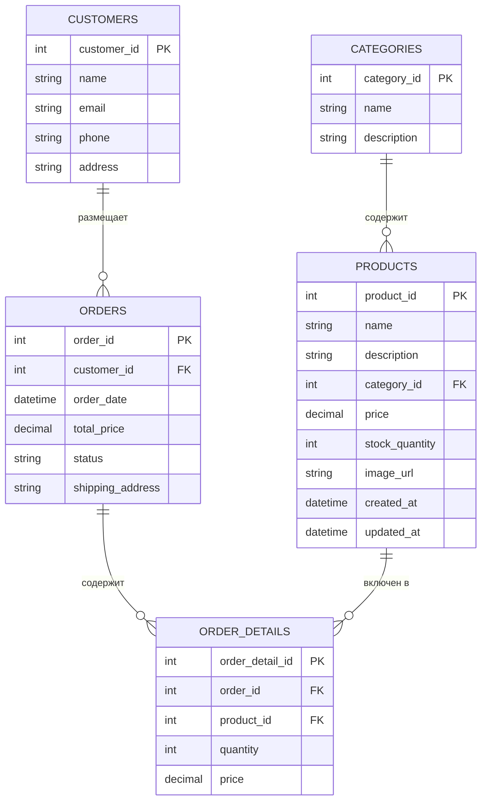
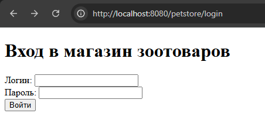
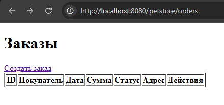
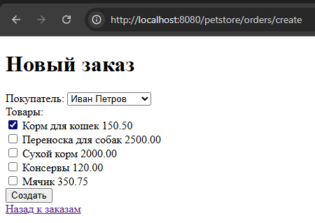

# Лабораторная работа №7. Spring Security. Basic Authentication

**Выполнил:** Хайруллин Эльдар Ринатович, группа 12002453

## Цель работы
Добавить в магазин зоотоваров ролевой доступ: пользователь с ролью USER может только просматривать заказы, а пользователь с ролью MANAGER — выполнять все операции. Реализовать аутентификацию через форму для веб-интерфейса и через Basic Auth для REST API.

## Используемые инструменты
- JDK 17
- Gradle 8.12
- Spring Context 6.2.2, Spring Web MVC 6.2.2, Spring Data JPA 3.4.4
- Spring Security 6.2.2
- Hibernate 6.6.8, HikariCP 6.2.1, H2 Database 2.3.232
- Thymeleaf 3.1.3, Jackson 2.18.2
- Apache Tomcat 11

## Структура проекта
```
les14/lab
├── app
│   ├── build.gradle.kts
│   └── src
│       ├── main
│       │   ├── java/ru/bsuedu/cad/lab
│       │   │   ├── AppConfig.java
│       │   │   ├── WebConfig.java
│       │   │   ├── SecurityConfig.java
│       │   │   ├── entity
│       │   │   │   ├── Category.java
│       │   │   │   ├── Product.java
│       │   │   │   ├── Customer.java
│       │   │   │   ├── Order.java
│       │   │   │   └── OrderDetail.java
│       │   │   ├── repository
│       │   │   │   ├── CategoryRepository.java
│       │   │   │   ├── ProductRepository.java
│       │   │   │   ├── CustomerRepository.java
│       │   │   │   ├── OrderRepository.java
│       │   │   │   └── OrderDetailRepository.java
│       │   │   ├── service
│       │   │   │   ├── DataLoaderService.java
│       │   │   │   └── OrderService.java
│       │   │   └── web
│       │   │       ├── OrderRestController.java
│       │   │       ├── OrderWebController.java
│       │   │       └── LoginController.java
│       │   ├── resources
│       │   │   ├── application.properties
│       │   │   ├── logback.xml
│       │   │   ├── category.csv
│       │   │   ├── product.csv
│       │   │   └── customer.csv
│       │   └── webapp
│       │       └── WEB-INF
│       │           ├── web.xml
│       │           └── views
│       │               ├── login.html
│       │               └── order
│       │                   ├── list.html
│       │                   ├── create.html
│       │                   └── edit.html
│       └── test/...
└── settings.gradle.kts
```

## Диаграмма классов


## Выполнение работы

### 1. Добавление зависимостей
- В `build.gradle.kts` добавлены `spring-security-web` и `spring-security-config`.

### 2. Конфигурация безопасности
- Создан класс `SecurityConfig` с двумя цепочками фильтров:
  * `apiFilterChain` для `/api/**` – требует роль `MANAGER`, использует HTTP Basic, без сессий.
  * `formFilterChain` для остальных запросов – form login, роль `USER` для просмотра, `MANAGER` для редактирования.
- Пользователи `user` и `manager` с паролем `12345` хранятся в памяти.

### 3. Кастомная страница входа
- Создан контроллер `LoginController` и шаблон `login.html` с формой входа.

### 4. Деплой и тестирование
- WAR собран и развернут на Tomcat 11.
- Проверен доступ для разных ролей.

## Результат работы

<details>
<summary>Страница входа</summary>



</details>

<details>
<summary>Список заказов (пользователь user)</summary>



</details>

<details>
<summary>Создание заказа (пользователь manager)</summary>



</details>

<details>
<summary>REST API Basic Auth (manager)</summary>

```json
[
  {
    "orderId": 1,
    "orderDate": "2026-05-17T14:53:46.000+00:00",
    "totalPrice": 2150.50,
    "status": "NEW",
    "shippingAddress": "Москва ул. Ленина 1",
    "customer": {
      "customerId": 1,
      "name": "Иван Петров"
    },
    "orderDetails": [
      {
        "orderDetailId": 1,
        "product": {
          "productId": 1,
          "name": "Корм для кошек"
        },
        "quantity": 1,
        "price": 150.50
      }
    ]
  }
]
```

</details>

## Инструкция по запуску
1. Собрать WAR: `gradle clean build war`.
2. Развернуть `petstore.war` в Tomcat 11.
3. Открыть `http://localhost:8080/petstore/orders`, войти как `user` или `manager`.

## Ответы на контрольные вопросы

**Что такое Spring Security и зачем он используется?**
Spring Security — это фреймворк для обеспечения безопасности Java-приложений, предоставляющий аутентификацию, авторизацию, защиту от атак (CSRF, XSS) и интеграцию с различными системами.

**Чем отличается аутентификация от авторизации?**
Аутентификация — проверка личности пользователя (кто ты?). Авторизация — проверка прав доступа (что тебе разрешено?).

**Что такое SecurityFilterChain и какова его роль в приложении?**
SecurityFilterChain — это цепочка фильтров безопасности, которая обрабатывает каждый HTTP-запрос, применяя правила аутентификации и авторизации.

**Как работает form-based аутентификация в Spring Security?**
Пользователь отправляет логин и пароль через HTML-форму, Spring Security проверяет их через `AuthenticationManager` и при успехе создаёт сессию.

**Что такое UserDetailsService и зачем он нужен?**
UserDetailsService — интерфейс для загрузки данных пользователя (логин, пароль, роли) из хранилища (память, БД, LDAP).

**Как задать роли пользователям и проверять их в коде?**
Роли задаются через `UserDetails` (`.roles("USER")`). В коде проверяются через `hasRole()`, `hasAnyRole()` в конфигурации или `@PreAuthorize` на методах.

**Что такое Basic Authentication и когда её удобно использовать?**
Basic Authentication — передача логина и пароля в заголовке `Authorization` в кодировке Base64. Удобна для REST API, где нет сессий.

**Как запретить доступ к URL-адресу без соответствующей роли?**
Через `.requestMatchers("/url").hasRole("ROLE_NAME")` в `SecurityFilterChain`.

**Как сделать свою страницу для входа (custom login page)?**
Указать `.loginPage("/custom-login")` в конфигурации formLogin и создать контроллер с соответствующим URL.

**Можно ли использовать одновременно form login и basic auth в одном проекте?**
Да, через несколько `SecurityFilterChain` с разными `securityMatcher`, как в данной работе.